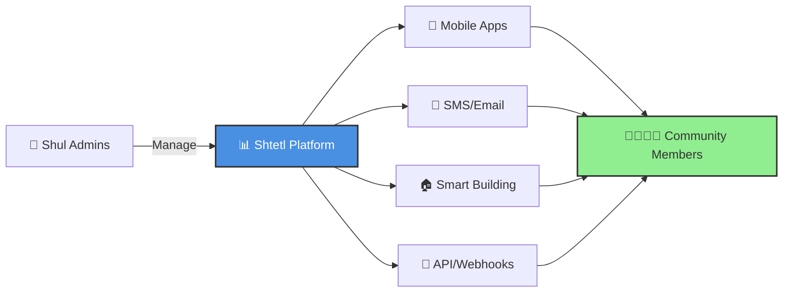

# 🕍 Shtetl - Many Shuls. One Community.

<div align="center">


**🌟 The Digital Heartbeat of Jewish Life 🌟**

*Unifying Jewish community communications into a centralized, intelligent hub*

[🚀 Get Started](#-quick-start) • [📖 Documentation](#-documentation) • [🤝 Contributing](#-contributing) • [💬 Community](#-community)

</div>

---

## 🎯 What is Shtetl?

**Shtetl** is a free, open-source platform that transforms fragmented Jewish community communications into a unified, intelligent ecosystem. No more juggling WhatsApp groups, printed bulletins, and endless phone calls about minyan times!

### 🌈 Key Features

<table>
<tr>
<td width="50%">

#### 🕐 **Smart Scheduling**
- ✅ Real-time zmanim calculations
- ✅ Automated minyan reminders
- ✅ Dynamic shiur schedules
- ✅ Holiday & special event handling

</td>
<td width="50%">

#### 📱 **Multi-Channel Access**
- ✅ Native mobile apps (iOS/Android)
- ✅ SMS alerts & notifications
- ✅ Web admin console
- ✅ API integrations (MCP/Zapier)

</td>
</tr>
<tr>
<td width="50%">

#### 🏛️ **Shul Management**
- ✅ Membership tracking
- ✅ Aliyos scheduling
- ✅ Yahrzeit reminders
- ✅ Simcha coordination

</td>
<td width="50%">

#### 🤖 **Smart Automation**
- ✅ Facility control (HVAC/Lighting)
- ✅ Personalized wake-up alarms
- ✅ Location-aware notifications
- ✅ Event-triggered actions

</td>
</tr>
</table>

---

## 🎨 Core Value Proposition

<div align="center">

### **"Find Your Minyan. Never Miss A Shiur. Stay Connected."**

</div>



---

## 🚀 Quick Start

...

---

## 🏗️ Architecture

<div align="center">

```
┌─────────────────────────────────────────────────────────┐
│                    🌐 Web Admin Console                 │
│                     (React + TypeScript)                │
└────────────────────┬────────────────────────────────────┘
                     │
┌────────────────────▼────────────────────────────────────┐
│                   🚪 API Gateway                        │
│                  (Golang + GraphQL)                     │
└────────┬──────────────────────────────┬─────────────────┘
         │                              │
┌────────▼────────┐            ┌───────▼────────┐
│  📱 Mobile Apps │            │ 🔌 Integrations │
│  (React Native) │            │  (MCP/Zapier)   │
└─────────────────┘            └─────────────────┘
         │                              │
┌────────▼──────────────────────────────▼─────────────────┐
│              💾 Core Services (Microservices)           │
│  • Schedule Service  • Alert Service  • Auth Service    │
│  • Automation Service • Zmanim Service • Event Service  │
└────────────────────┬────────────────────────────────────┘
                     │
┌────────────────────▼────────────────────────────────────┐
│                 🗄️ Data Layer                           │
│         MongoDB (Documents) + Redis (Cache)             │
└──────────────────────────────────────────────────────────┘
```

</div>

---

## 📊 Project Status & Roadmap

### 🎯 Current Phase: **Research & Planning**

<div align="center">

| Phase | Status | Target Date |
|-------|--------|-------------|
| 🔍 **Research & Planning** | ✅ Complete | Q3 2025 |
| 🏗️ **MVP Development** | 🟡 In Progress | Q1 2026 |
| 🧪 **Beta Testing** | ⏳ Planned | Q3 2026 |
| 🚀 **Public Launch** | ⏳ Planned | Q4 2026 |

</div>

### 🎁 MVP Features (Q1 2026)
- [ ] Shul admin portals
- [ ] Minyan scheduling
- [ ] Mobile app (iOS/Android)
- [ ] SMS/Email notifications
- [ ] Zmanim calculations

### 🚀 Post-MVP Vision (Q1-Q4 2027)
- [ ] Complete membership management
- [ ] Aliyos & yahrzeit tracking
- [ ] Public APIs
- [ ] Multi-language support (Hebrew/Yiddish)
- [ ] Advanced automation features
- [ ] Cross-Shul discovery

---

## 🤝 Contributing

We welcome contributions from developers, designers, and community members!

### 🛠️ How to Contribute

1. **Fork the repository**
2. **Create your feature branch** (`git checkout -b feature/AmazingFeature`)
3. **Commit your changes** (`git commit -m 'Add some AmazingFeature'`)
4. **Push to the branch** (`git push origin feature/AmazingFeature`)
5. **Open a Pull Request**

### 🎨 Areas We Need Help

<table>
<tr>
<td>

**💻 Leadership**

- Technical Leadership
- Project Management
- Architecture & Design
- PR Reviews

</td>
<td>
&nbsp;

**💻 Development**

- Frontend (React/React Native)
- Backend (Golang)
- Mobile development
- Business Analysis
- QA

&nbsp;
</td>
<td>

**🎨 Design**

- UI/UX design
- Mobile app design
- Logo & branding
- Documentation

</td>
<td>

**📝 Community**

- Testing & feedback
- Translation
- Community outreach
- Design Partners

</td>
</tr>
</table>

---

## 💬 Community

Join our growing community of contributors and users!

<div align="center">

[](#)
[](https://github.com/jcom-dev/shtetl/discussions)

</div>

### 🌟 Success Metrics

<div align="center">

| Metric | Target | Current |
|--------|--------|---------|
| 🏛️ **Active Shuls** | 15 | 0 |
| 👥 **Active Users** | 1,000+ | 0 |
| 📱 **Daily Active Users** | 70% | - |

</div>

---

## 📖 Documentation

- 📋 [Project Brief](docs/brief.md) - Comprehensive project overview
- 🏗️ [Architecture Guide](docs/architecture/README.md) - Technical architecture details
- 🚀 [Getting Started](docs/getting-started.md) - Quick start guide
- 📚 [API Documentation](docs/api/README.md) - API reference
- 🤝 [Contributing Guide](CONTRIBUTING.md) - How to contribute

---

## 🛡️ Technical Stack

<div align="center">


</div>

---

## 📜 License

This project is open source and available under the [GPL License](LICENSE).

---

## 🙏 Acknowledgments

- All our amazing contributors and community members
- The Shuls partnering with us as design partners
- Open source projects that make this possible

---

<div align="center">

### **🌟 Together, we're building the future of Jewish community connectivity 🌟**

**Made with ❤️ by the Jewish tech community**

[⬆ Back to top](#-shtetl---unite-your-jewish-community)

</div>